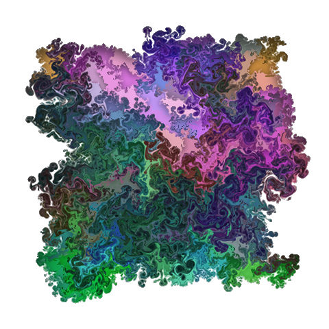

# shadower
Add soft shadows to a png image

### Using shadower

    make
    ./shadower -h
    ./shadower in.png -sc=0.6 -sw=2.0 -ss=0.06 -nb=20 -o=out.png

The last command turns the image on the left into the image on the right.

### Thanks

Many thanks to Lode Vandevenne for the [LodePNG](http://lodev.org/lodepng/) code!
